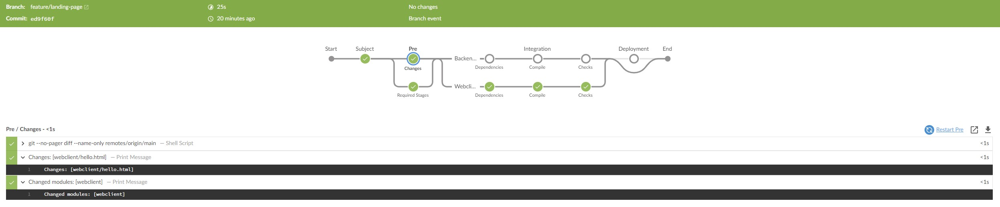

# Monorepo Jenkinsfile Template

A Jenkinsfile template 📄 for a _monorepo_ project 👨‍💻, which allows for its modules to be integrated ⚙ and deployed 📦 _independently_.

At the time of writing, this template is used with _Jenkins 2.303.1_.

## Motivation and Background
[Jenkins](https://www.jenkins.io/) is a popular build-pipeline choice for companies as it is open-source and companies can introduce their own agents. 

Further, e.g., web apps tend to be developed in a [monorepo](https://en.wikipedia.org/wiki/Monorepo) as their _parts_ (e.g., _api_ and _client_; I'll refer to them as _modules_) are usually changed together; thus, teams can benefit from some advantages of monorepos.

However, there are many changes that touch only certain parts of the system; e.g., refactoring code, writing documentation, fixing translations, changing infrastructure. For these, we need **independent** builds and deployments.

Jenkins is not capable to provide useful _change sets_; its implementation of `changeset` is based on previous build, and thus, does not work for `feature` and `release` branches, or when working with [rebase](https://git-scm.com/docs/git-rebase) (cf. [clean history](https://github.com/andrej-dyck/git-kata)).

Thus, this repository comprises a Jenkinsfile ([declarative pipeline](https://www.jenkins.io/doc/book/pipeline/syntax/)) that can identify changes via `git diff` depending on what is built, and then, _integrate_ (compile and test) and _deliver/deploy_ changed modules independently.

## Context and Caveats
In our project, we follow a (slightly adapted) [trunk-based development workflow](https://trunkbaseddevelopment.com/):

First thing to note is that `feature` branches are always rebased onto `main` before merge. Further, the merge into `main` is done via a merge commit (while keeping the linear history); this gives us a nice visual group of commits that belong together.

Furthermore, `release` branches are used for releases; as they provide the possibility to prepare a release[^2] and [cherry pick](https://git-scm.com/docs/git-cherry-pick) fixes when needed. However, releases are built only when the HEAD has a valid _release tag_; this way we don't forget to tag the release.

[^2]: In our project, changelogs are mandatory by law and must exist during start of the application.

### Defining Changes
The changes are determined depending on what is being built (aka on which branch we are).
* On `main` (as we work with merge commits), the diff are the changes to the _previous commit_ (i.e., _HEAD~1_) on `main`.
* On `feature` (and `bugfix`), the diff are the changes between the current branch and `main`.
* On `release` (and `hotfix`), the diff are the changes since the previous release (i.e., the preceding _release tag_)[^3][^4]

[^3]: To determine the order of releases, the method in this template uses `sort -V` to sort by versions.

[^4]: As the very first release wouldn't build (it not having a preceding release tag), we recommend tagging the initial commit of the repository (e.g., as Release-0). 

### Deployment vs Delivery
In our workflow, all changes in `main` are deployed to a _staging_ environment (the delivery of a release candidate). Then, _releases_ and _hotfixes_ are deployed to the _production_ environment.

We decided to deploy `hotfix/*` directly into _production_, once their branch head has a release tag. So they are quite similar to `release/*` branches; but with a different name and that they are always build and tested.  

Note: Since all modules should be deployable independently, they need to have their own infrastructure as code specifications.

### Jenkins Declarative Pipeline Limitations
Unfortunately, Jenkins does not allow the extraction of full stage declarations (with agents, environments, conditionals, steps) into separate files. Either only Jenkins steps that can be written in `step` (e.g., `sh`) can be extracted or a full `pipeline`. The latter is, however, limited by the fact that Jenkins allows only exactly one pipeline to run.

Furthermore, the [build step](https://www.jenkins.io/doc/pipeline/steps/pipeline-build-step/) can only trigger other build jobs. Thus, in a [multibranch pipeline](https://www.jenkins.io/doc/book/pipeline/multibranch/) configuration this step cannot be used to trigger extracted stages.  

### What is in it for Non-Monorepos?
There are two ideas that can benefit a single-project repository.[^1]

[^1]: When you read motivation and context carefully, you'll notice that it has barely anything to do with multiple projects within a repository and is more about what has changed.

#### Decisions vs Actions
One core idea is, which has nothing to do with change sets, is that the decision of what is built and what steps are required is extracted into their own stages. This way, the `when` declarations are not polluted with duplicated conditionals; which makes maintenance and changes harder and more error-prone.

#### Changes-based Builds
With the knowledge of what the changes are (at least which files changed), you can determine which stages are necessary to execute and which can be skipped. For example, changes to documentation or readme files might skip the _compile_ and _test_ stages. Or changes to infrastructure code only trigger the _deployment_ stage.

## Example Runs
Here are some example runs on how the pipeline looks like.

_Integrates and deploys everything on `main`_

_Integrates only changes to one module on `feature`_

_Integrates and deploys only changes of `feature` merged back into `main`_

_Deploys changes since previous release on `release` (with tag)_

_Release is aborted when HEAD of `release` has no tag_

## Jenkins Settings
By default, Jenkins does not check out the history (shallow clone)[^5], tags and does not reference all remote branches. However, in order to determine changes via `git diff`, the Jenkins configuration needs the following setting:

[^5]: A shallow clone makes the checkout much faster! So you definitely loose time here checking out the complete history.

### Why not use Jenkins PR/Tags?
We found that Jenkins _PR-_ and _Tag discovery_ is flaky and unreliable (especially when working with rebase). So, with this Jenkinsfile, we discover only named branches and determine changes ourselves. Further, they do not solve Jenkins' issue with the change set.

## Further Ideas
* For each changed module, a pre-stage can determine what stages need to be executed and which can be skipped.
* For a more synchronized deployment of all parts, the _deployment_ stage can be split into _delivery_ (preparing the deployment) and _provisioning_ stages.
* A separate acceptance stage (3rd-party api tests, smoke tests, etc.) can be introduced between integration and deployment.
* Get inspired and build your own pipeline 😉.